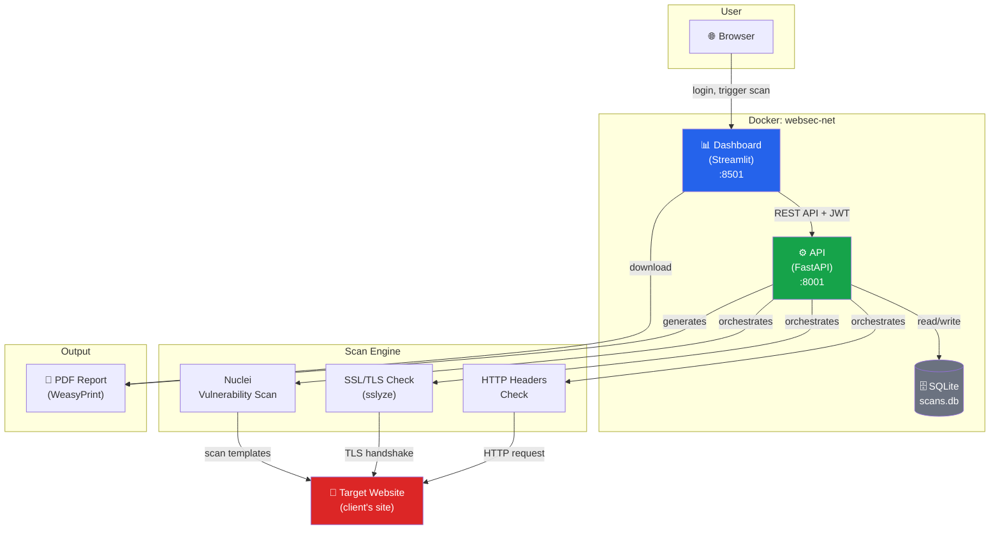

# 🛡️ WebSec Scanner

**Automated website security assessment platform** — built during a one-month internship at a marketing & digital services agency.

Enter a target URL → the platform runs a multi-tool security scan → findings are scored, mapped to OWASP Top 10 categories, and presented in a dashboard → a client-ready PDF report is generated.

---

## Why this project

Marketing/digital agencies build and maintain websites for clients but rarely have dedicated security tooling. This project automates a first-pass security assessment — the kind of check an agency could run before or after a client site launch — combining industry-standard scanning tools behind a simple web interface, with results an account manager (not just a security engineer) could understand.

---

## Architecture



**Flow:** User logs in → selects an authorized target → triggers a scan → API runs three checks in parallel → findings are normalized, scored, and mapped to OWASP Top 10 → results stored in SQLite → dashboard displays grouped findings + risk grade → PDF report generated on demand.

---

## Features

- 🔍 **Multi-tool scanning** — HTTP security headers, SSL/TLS configuration (sslyze), vulnerability templates (Nuclei)
- 📊 **Risk scoring** — severity-weighted score (0–100) with a letter grade (A+ to F)
- 🗂️ **OWASP Top 10 (2021) mapping** — findings classified using CWE IDs (industry-standard weakness classification) where available
- 🔐 **JWT authentication** — login-protected API and dashboard
- ✅ **Authorized-targets safeguard** — scans can only run against pre-approved domains, enforcing scope and consent
- 👥 **Client management** — targets and scan history organized by client, not just raw URLs
- 📄 **PDF report export** — client-ready report, grouped by OWASP category
- 🐳 **Fully Dockerized** — one command (`docker compose up`) runs the entire platform

---

## Tech stack

| Layer | Technology |
|---|---|
| Scan engine | Python, Nuclei, sslyze, requests |
| Backend API | FastAPI, SQLAlchemy, SQLite |
| Authentication | JWT (python-jose), bcrypt (passlib) |
| Frontend | Streamlit, Plotly |
| Reporting | Jinja2, WeasyPrint (HTML → PDF) |
| Deployment | Docker, Docker Compose |

---

## Getting started

### Prerequisites
- Docker and Docker Compose installed

### Run the platform
```bash
git clone https://github.com/AyaOuzarf/websec-scanner.git
cd websec-scanner
docker compose up --build
```

- API docs: [http://localhost:8001/docs](http://localhost:8001/docs)
- Dashboard: [http://localhost:8501](http://localhost:8501)

### First-time setup
```bash
curl -X POST http://localhost:8001/auth/register \
  -H "Content-Type: application/json" \
  -d '{"username": "your_username", "password": "your_password"}'
```
Then log in through the dashboard.

⚠️ **Only scan domains you own or have explicit written authorization to test.** The platform enforces an authorized-targets list before any scan can run.

---

## Project structure

```
websec-scanner/
├── scanner/           # Core scan engine (checks + orchestrator)
│   ├── checks/         # headers.py, ssl_check.py, nuclei_scan.py
│   └── utils/          # risk scoring, OWASP/CWE mapping
├── api/                # FastAPI backend
│   ├── routes/          # auth, scans, targets, clients
│   ├── models/          # database models, request/response schemas
│   └── utils/           # auth (JWT), authorization checks
├── dashboard/          # Streamlit frontend
├── reports/            # PDF generation (Jinja2 + WeasyPrint templates)
├── targets/            # Local vulnerable lab (WordPress, DVWA, Juice Shop) for safe testing
├── docker/             # Dockerfiles for API and dashboard
└── docker-compose.yml  # Platform orchestration
```

---

## Local testing environment

Since scanning real client sites without prior written authorization raises legal/ethical concerns, this project includes a local, disposable lab (`targets/docker-compose.yml`) with intentionally vulnerable services — WordPress, OWASP Juice Shop, and DVWA — used to develop and validate every check safely.

---

## Author

Eya — Cybersecurity student, ENSET Mohammedia (Université Hassan II de Casablanca). Built during a one-month internship, marketing/digital agency.
